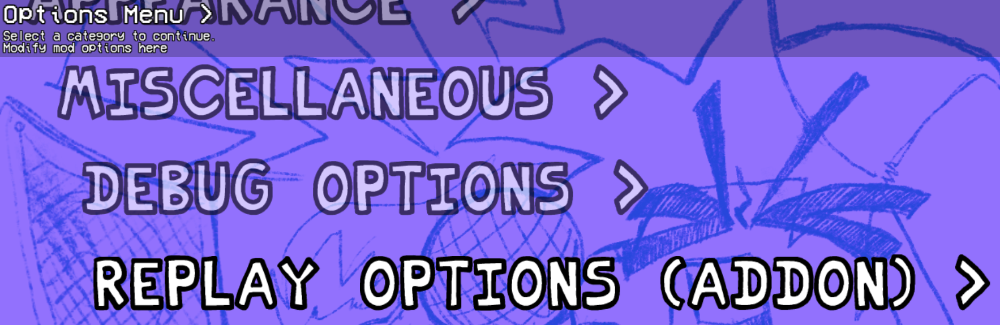
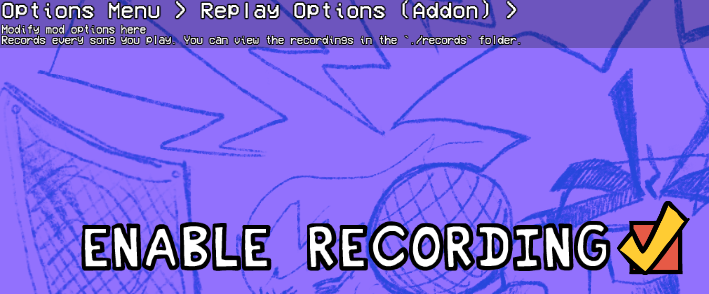
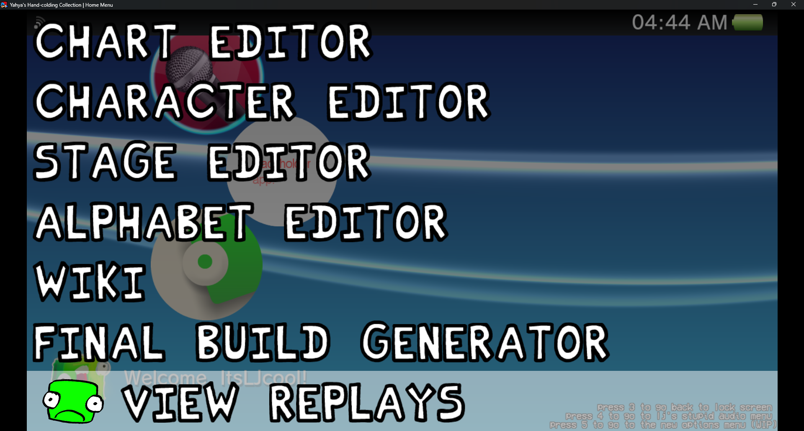

# Codename Engine v1.0.0+ | Replays Addon
This addon will record, and store your replays in your `./replays` folder!
### (Tested on v1.0.1)
## Special Thanks
- [Nex_isDumb](https://linktr.ee/just_nex) they made the original script in 10 minutes, I just converted it into a Class, then to an Addon.


### Consider Donating to me!
I work on some Addons / Projects alone, and I don't get paid for any of it.
<br>I'm also in a financial hardship, anything helps ❤️

[](https://ko-fi.com/X8X4PZBTA)

# How to use
Go to options and enable the "Enable Recording" option.




Thats it! Every time you play and finish a song, it will be saved in the `./replays` folder.

To view replays, you need to be able to access the `EditorPicker` menu for now, but it's easy to access it by generating it through code.


### How to access the EditorPicker Menu if mod doesn't allow you to access it
Just plop this code in the state you want to access the EditorPicker Menu from.

(For you non-cne modders, make sure there are no duplicate `update` functions or this won't work)
```haxe
import funkin.editors.EditorTreeMenu;

function update(elapsed:Float) {
    if (controls.DEV_ACCESS) {
        persistentUpdate = false;
        persistentDraw = true;
        openSubState(new EditorPicker());
    }
}
```
## Known Issues
- [ ] Still able to hit notes during replays